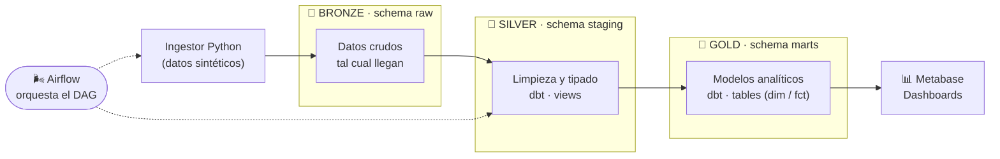
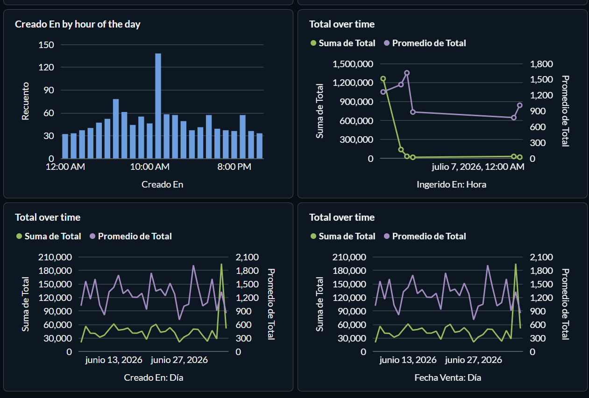

# 🛰️ Pipeline ELT Batch — Arquitectura Medallion

Pipeline de datos **batch/ELT** montado íntegramente con **Docker Compose** como material de prácticas para Data Engineering (IFCD0077). Reproduce el patrón que hoy usa la mayoría de empresas medianas: ingesta → transformación en SQL → orquestación → BI, todo aplicando una **arquitectura Medallion** (bronze → silver → gold) sobre PostgreSQL.


---

## 🏅 Arquitectura Medallion

El corazón del proyecto es la **arquitectura Medallion**: los datos avanzan por capas de calidad creciente, cada una con una responsabilidad clara y una materialización distinta en PostgreSQL.



| Capa | Medallion | Schema | Qué contiene | Materialización |
|------|-----------|--------|--------------|-----------------|
| **Bronze** | 🥉 Raw | `raw` | Datos crudos cargados por el ingestor, sin transformar | Tablas |
| **Silver** | 🥈 Staging | `staging` | Limpieza, renombrado, tipado y normalización | **Views** (dbt) |
| **Gold** | 🥇 Marts | `marts` | Modelo dimensional y agregados listos para consumo | **Tables** (dbt) |

> El proyecto dbt usa un macro `generate_schema_name` para que los esquemas se llamen exactamente `staging` y `marts`, evitando el prefijo por defecto (`public_staging`, `public_marts`).

---

## 📊 Dashboard (Metabase)

La capa **gold** alimenta directamente los dashboards de Metabase. Ejemplo de análisis de ventas construido sobre los marts:



Métricas visualizadas: distribución de registros por hora de creación, evolución de la **suma** y el **promedio** del total de ventas a lo largo del tiempo (por hora de ingesta, por día de creación y por fecha de venta).

---

## 🧱 Stack de servicios

Todo corre en contenedores dentro de una única red de Docker Compose:

| Servicio | Imagen | Puerto (host) | Rol |
|----------|--------|---------------|-----|
| **postgres** | `postgres:16` | `5433` | Almacén de datos (raw/staging/marts) + metadata de Airflow |
| **ingest** | Python 3.12 (custom) | — | Genera y carga los datos crudos en `raw` |
| **dbt** | dbt-postgres (custom) | `8081` | Transformaciones + `dbt docs` |
| **airflow** | `apache/airflow` | `8080` | Orquestación del pipeline (LocalExecutor) |
| **adminer** | `adminer:latest` | `8082` | Cliente web para inspeccionar la BD |
| **metabase** | `metabase/metabase` | `3000` | BI / dashboards |

> Los puertos se definen en `.env`; ajústalos si tienes conflictos en tu máquina.

---

## 🌬️ Orquestación con Airflow

El DAG ejecuta el pipeline completo como una secuencia de tareas discretas (`BashOperator`, ejecución manual por defecto):

```
ingest  →  dbt build  →  dbt test  →  notify
```

- **ingest** — carga un lote nuevo de datos en `raw`.
- **dbt build** — construye las capas `staging` (views) y `marts` (tables).
- **dbt test** — valida los modelos (tests de dbt).
- **notify** — cierre / notificación del run.

Airflow usa una base de datos `airflow` separada dentro del mismo PostgreSQL para su metadata.

---

## 📁 Estructura del proyecto

```
.
├── docker-compose.yml
├── .env
├── assets/
│   └── metabase-dashboard.png
├── init-db/
│   └── 01-init.sql            # crea la BD de metadata de Airflow
├── ingest/
│   ├── Dockerfile
│   ├── requirements.txt
│   └── *.py                   # carga inicial + carga por lotes
├── dbt/
│   ├── Dockerfile
│   ├── profiles.yml
│   ├── dbt_project.yml
│   ├── macros/
│   │   └── generate_schema_name.sql
│   └── models/
│       ├── staging/           # views  (🥈 silver)
│       └── marts/             # tables (🥇 gold)
└── airflow/
    └── dags/
        └── pipeline.py
```

---

## 🚀 Puesta en marcha

Requisitos: **Docker** y **Docker Compose**.

```bash
# 1. Clonar y entrar
git clone <url-del-repo>
cd <repo>

# 2. Configurar variables (usuario, password, puertos...)
cp .env.example .env

# 3. Levantar la infraestructura
docker compose up -d

# 4. Ejecutar el pipeline manualmente (o lanzarlo desde Airflow)
docker exec pipeline_ingest python initial_load.py
docker compose run --rm dbt dbt build
```

### Accesos

| Herramienta | URL |
|-------------|-----|
| Airflow | http://localhost:8080 |
| Adminer | http://localhost:8082 |
| dbt docs | http://localhost:8081 |
| Metabase | http://localhost:3000 |

---

## 🎓 Contexto

Material didáctico del certificado de profesionalidad **IFCD0077**. El objetivo es que el alumnado toque de primera mano un pipeline ELT real de principio a fin: contenedores, esquemas, modelado en dbt, orquestación con Airflow y explotación en un dashboard de BI, todo articulado sobre una arquitectura Medallion.
